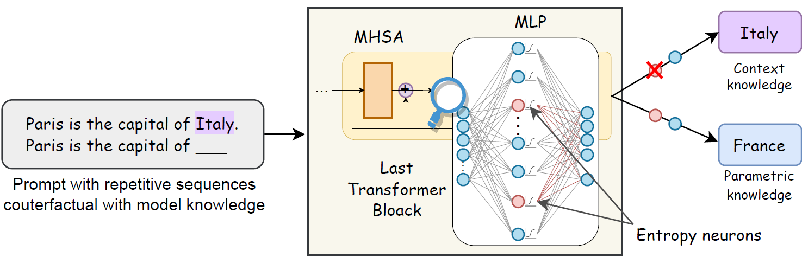

# Context Copying Modulation: The Role of Entropy Neurons in Managing Parametric and Contextual Knowledge Conflicts

<p align="center">
    <br>
    
    <br>
<p>

# Overview

This repository contains the code to reproduce the results of the *Context Copying Modulation: The Role of Entropy Neurons in Managing Parametric and Contextual Knowledge Conflicts* paper under review at COLM 2025.

# Abstract

<p>
    The behavior of Large Language Models (LLMs) when facing contextual information that conflicts with their internal parametric knowledge is inconsistent, with no generally accepted explanation for the expected outcome distribution. Recent work has identified in autoregressive transformer models a class of neurons -- called 
    -- that produce a significant effect on the model 
    while having an overall moderate impact on the ranking of the predicted tokens. In this paper, we investigate the preliminary claim that these neurons are involved in inhibiting context copying behavior in transformers by looking at their role in resolving conflicts between contextual and parametric information. We show that 
    are responsible for suppressing context copying across a range of LLMs, and that ablating them leads to a substantial change in the generation process. These results enhance our understanding of the internal dynamics of LLMs when handling conflicting information.
</p>

# Supported language models

Experiments can be executed on the following language models:

- Phi-1.5
- GPT2-small
- Llama3-8B
- Mistral-7B-v0.1
- Pythia-1.4B

# Steps to Reproduce the Results

This repository requires Python version 3.9.17.

## 1. Install framework package:

First create a conda environment:
```sh
conda create --name context_copying_modulation python=3.9.17
conda activate context_copying_modulation
```

then install the requirements:
```sh
pip install -r project-requirements.txt
```

**Important:** set up the `HUGGINGFACE_TOKEN` constant in the `src/model.py` module with your huggingface access token to load the LLMs from the huggingface hub.

Finally install the package with `pip`:
```sh
pip install .
```

## 2. Reproduce the results in the paper:

**Important:** before running the `pipeline.sh` script, make sure to add execution permission:
```sh
chmod +x ./scripts/entropy_neurons_scripts/pipeline.sh
```

### For all the models:
```sh
./scripts/entropy_neurons_scripts/pipeline.sh --ablation_value <ablation_value> --device <device>
```

### For a specific model:
```sh
./scripts/entropy_neurons_scripts/pipeline.sh --model_name <model_name> --ablation_value <ablation_value> --device <device>
```

### Arguments

- `<model_name>`: the name of the model. Options are `gpt2-small`, `EleutherAI_pythia-1.4b`, `Phi-1_5`, `Mistral-7B-v0.1`, `Meta-Llama-3-8B`.
- `<device>`: the device on which to load the LLMs (`cuda` or `cpu`)
- `<ablation_value>`: the value to use for ablation. Options are `mean_ablation` (used in the main paper), `mode_ablation`, `median_ablation`, `mean_minus_sigma_ablation`, `mean_plus_sigma_ablation`

## 3. Paper Results:

After running the `pipeline.sh` script, you can find the paper figures and tables in the `<ablation_value>-<model_name>-datetime` or `all_ablation_values-all_models-datetime` folder depending if the scripts was performed on one model or all the models/all the ablation values (see above).

### Figures:

The figure can be found in the `entropy_neurons_figures` sub-folder:

- `entropy_neurons_figures/<model_name>/<model_name>_logitvar_and_rho-nb_neurons_with_low_logitvar=6.png`: the selected entropy neurons for `<model_name>` displayed on the $LogitVar$ and $\rho$ axis.
- `entropy_neurons_figures/<model_name>/singular_values_and_null_space_nb_dims=40.pdf`: figure with the singular values and the selected null space (in red) for the unembedding matrix $W_U$.
- `entropy_neurons_figures/<model_name>/<model_name>_weight_norm_distro-nb_neurons_with_low_logitvar=<nb_selected_entropy_neurons>.png`: the weight norm distribution for entropy neurons (red) and other neurons (blue).
- `entropy_neurons_figures/<model_name>/<model_name>_<ablation_value>-conversion_ratios.pdf`: the Conversion Ratio figure for all the knowledge categories (CK, PK, and ND).
- `entropy_neurons_figures/<model_name>/<model_name>_<ablation_value>_transition_score.png`: the Global Transition Score histogram for random neurons (blue bars) and entropy neurons (red dashed line).
- `entropy_neurons_figures/<model_name>/<model_name>_<ablation_value>_ablation_log_ck_pk.pdf`: the $\log\frac{P_{CK}}{P_{PK}}$ ratio with a decision boundary at 0.
- `entropy_neurons_figures/<model_name>/<model_name>_<ablation_value>_ablation_log_nd_ck.pdf`: the $\log\frac{P_{ND}}{P_{CK}}$ ratio with a decision boundary at 0.
- `entropy_neurons_figures/<model_name>/<model_name>_<ablation_value>_ablation_log_nd_pk.pdf`: the $\log\frac{P_{ND}}{P_{PK}}$ ratio with a decision boundary at 0.
- `entropy_neurons_figures/<model_name>/<model_name>_<ablation_value>_ablation_empirical_noises.pdf`: the $\Delta \text{log-ratio}$ of `<model_name>`, i.e. the difference between each log-ratio before and after ablation.

### Latex Tables:

The latex tables can be found in the `latex_tables` sub-folder:
- `latex_tables/<model_name>/<model_name>-<ablation_value>-synthetic_table_proportions.txt`: the latex source code for the Transition Scores table, including the necessary packages and header.

### Hardware:

The experiments in the paper where performed on an NVIDIA H100 GPU with 80GB of VRAM.